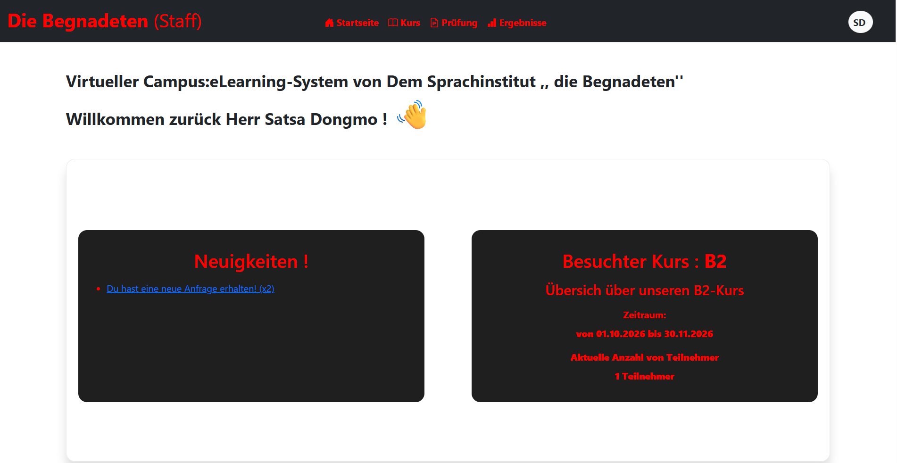
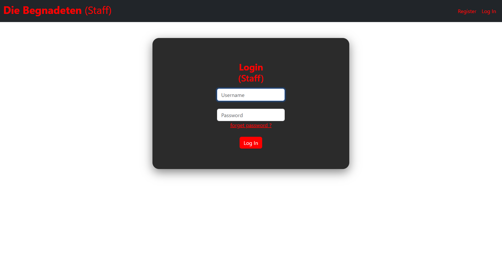
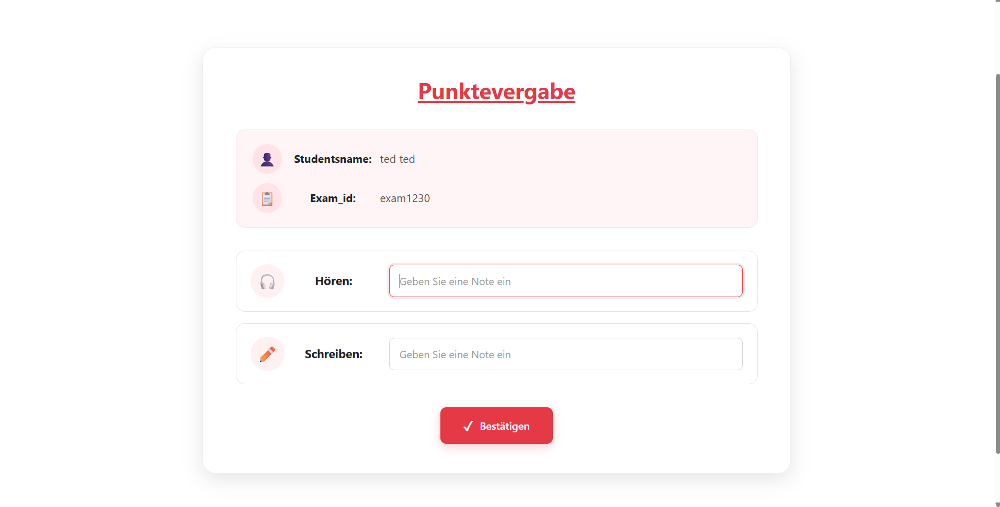

# Die Begnadeten – Sprachzentrum

> Eine selbst entwickelte Webanwendung zur Verwaltung eines kleinen Sprachzentrums – mit getrennten Bereichen für Studenten und Lehrer.

## 👋 Für Besucher

**Die Begnadeten – Sprachzentrum** ist ein kleines E-Learning- und Verwaltungssystem für einen Sprachkursanbieter.

Studenten können sich registrieren, Deutschkurse von **A1 bis C1** ansehen, Kurse buchen, an Prüfungen teilnehmen und ihre Ergebnisse einsehen. Lehrer bzw. Staff können Kurse und Teilnehmer verwalten, Prüfungen erstellen und Punkte eintragen.

Das Projekt ist vor allem ein persönliches Lern- und Praxisprojekt. Dabei habe ich eine vollständige kleine Webanwendung mit **Python, Flask, HTML, CSS und JavaScript** umgesetzt – von der Benutzeranmeldung bis zur Prüfungsverwaltung.

## 📸 Einblicke in die Anwendung

### Studenten-Dashboard



### Staff-Login



### Punktevergabe für Prüfungen



## ✨ Funktionen

### Studenten

- Benutzerkonto erstellen und anmelden
- Persönliche Daten und Deutsch-Niveau verwalten
- Deutschkurse von A1 bis C1 ansehen
- Kursinhalte, Grammatik, Ziele und Fähigkeiten ansehen
- Einen Kurs buchen
- An Prüfungen teilnehmen oder die Teilnahme verwerfen
- Prüfungsergebnisse ansehen
- Passwort ändern
- Neuigkeiten ansehen

### Lehrer / Staff

- Separater Login- und Registrierungsbereich
- Kurse und Teilnehmer verwalten
- Anfragen von Studenten bearbeiten
- Prüfungen erstellen
- Prüfungen mit Modulen, Uhrzeiten und Räumen verwalten
- Prüfungsteilnehmer ansehen
- Punkte für Prüfungen vergeben
- Ergebnisse für Studenten speichern und anzeigen
- Neuigkeiten verwalten

## 🛠️ Technologien

- **Python**
- **Flask** – Webframework
- **Jinja2** – Templates
- **Flask-Session** – Sessions
- **Werkzeug** – Passwort-Hashing und Passwortprüfung
- **JSON** – Datenhaltung in Version 1
- **HTML / CSS / JavaScript** – Benutzeroberfläche und Interaktionen
- **Bootstrap 5.3.3** – Layout und UI-Komponenten
- **Bootstrap Icons** – Icons im Staff-Bereich

## 📁 Projektstruktur

```text
version1/
│
├── app.py                       # Flask-Anwendung für Studenten
├── users.json                   # Studentenkonten
├── kurs.json                    # Kursdaten
├── kursinfo.json                # Kursinformationen
├── anfrage.json                 # Kursanfragen
├── exam_teilnahme.json          # Prüfungsteilnahmen
├── more.json                    # Studentendaten
├── neuigkeit_student.json       # Neuigkeiten für Studenten
├── templates/                   # Student-Templates
├── static/                      # CSS und JavaScript für Studenten
├── docs/
│   └── screenshots/             # Screenshots für die README
│
└── lehrer/
    ├── app.py                   # Flask-Anwendung für Lehrer/Staff
    ├── users_lehrer.json        # Lehrerkonten
    ├── exam.json                # Prüfungen
    ├── ergebnis.json            # Prüfungsergebnisse
    ├── new.json                 # Kurs-/Verwaltungsdaten
    ├── more_lehrer.json         # Lehrerdaten
    ├── neuigkeit_lehrer.json    # Neuigkeiten für Kurse
    ├── templates/               # Staff-Templates
    └── static/                  # CSS und JavaScript für Staff
```

## ▶️ Installation

Benötigt werden:

- Python 3
- pip
- ein moderner Webbrowser

Es wird empfohlen, eine virtuelle Umgebung zu verwenden:

```bash
python -m venv .venv
```

### Windows

```powershell
.venv\Scripts\activate
pip install flask flask-session werkzeug
```

## 🚀 Anwendung starten

### Studentenbereich

Im Ordner `version1` ausführen:

```bash
python app.py
```

Danach die von Flask angezeigte lokale Adresse im Browser öffnen, normalerweise:

```text
http://127.0.0.1:5000/
```

### Lehrer-/Staff-Bereich

In den Ordner `version1/lehrer` wechseln:

```bash
cd lehrer
python app.py
```

Anschließend die von Flask angezeigte lokale Adresse öffnen.

> Studenten- und Staff-Bereich sind als getrennte Flask-Anwendungen aufgebaut.

## 📝 Datenhaltung in Version 1

In der aktuellen Version werden die Anwendungsdaten über **JSON-Dateien** gespeichert. Dazu gehören unter anderem Studenten, Lehrer, Kurse, Prüfungen, Prüfungsteilnahmen und Ergebnisse.

Sessions werden über `Flask-Session` gespeichert.

## 🔐 Authentifizierung

Studenten und Lehrer besitzen eigene Login-Bereiche. Nach erfolgreicher Anmeldung wird die Benutzer-ID in der Flask-Session gespeichert.

Geschützte Seiten verwenden einen `login_required`-Decorator. Passwörter werden mit Werkzeug gehasht und beim Login überprüft.

## 📚 Prüfungsablauf

1. Ein Lehrer erstellt eine Prüfung.
2. Die Prüfung erhält Datum, Ort und ausgewählte Module.
3. Für die Module können Uhrzeit und Raum festgelegt werden.
4. Studenten sehen verfügbare Prüfungen.
5. Studenten bestätigen oder verwerfen ihre Teilnahme.
6. Lehrer sehen die Teilnehmer.
7. Lehrer tragen die Punkte für die Module ein.
8. Die Ergebnisse werden gespeichert und für Studenten angezeigt.

## 🇩🇪 Kurse

Die Anwendung enthält Deutschkurse von **A1 bis C1**. Zu den Kursinformationen gehören unter anderem:

- Lehrer
- Kurszeit
- Übungszeit
- Themen
- Grammatik
- Fähigkeiten
- Lernziele

## 🎨 Benutzeroberfläche

Die Benutzeroberfläche basiert auf HTML, CSS und JavaScript. Jinja2 wird für die Flask-Templates verwendet. Bootstrap 5.3.3 unterstützt Layout und UI-Komponenten.

## 🔜 Version 2.0 – bereits geplant

**Version 2 kommt als nächster größerer Schritt.**

Der wichtigste Unterschied: Die aktuelle Version verwendet JSON-Dateien, während **Version 2 mit einer Datenbank** weiterentwickelt wird. Dadurch soll die Datenhaltung strukturierter und besser für die weitere Entwicklung geeignet sein.

Weitere Verbesserungen können anschließend Schritt für Schritt ergänzt werden.

## ⚠️ Hinweis

Version 1 ist vor allem eine **Lern- und Projektanwendung** und nicht als produktives System gedacht.

## 🎯 Ziel des Projekts

Das Projekt dient dazu, praktische Erfahrungen mit folgenden Themen zu sammeln:

- Python
- Flask
- Webentwicklung
- Routing
- Sessions und Login-Systeme
- Jinja2-Templates
- Formulare und HTTP-Requests
- JSON-Dateiverarbeitung
- HTML / CSS / JavaScript
- Bootstrap

## 📌 Projektstatus

**Version 1.0 – erste funktionsfähige Version**

Die wichtigsten Abläufe für Studenten und Lehrer sind umgesetzt. Die Anwendung wird anschließend weiterentwickelt. **Version 2.0 mit Datenbank ist bereits geplant und kommt als nächster Entwicklungsschritt.**

---

**Projektname:** Die Begnadeten – Sprachzentrum  
**Aktuelle Version:** 1.0  
**Nächste Version:** 2.0 – Datenbank-basiert  
**Technologien:** Python / Flask / HTML / CSS / JavaScript
